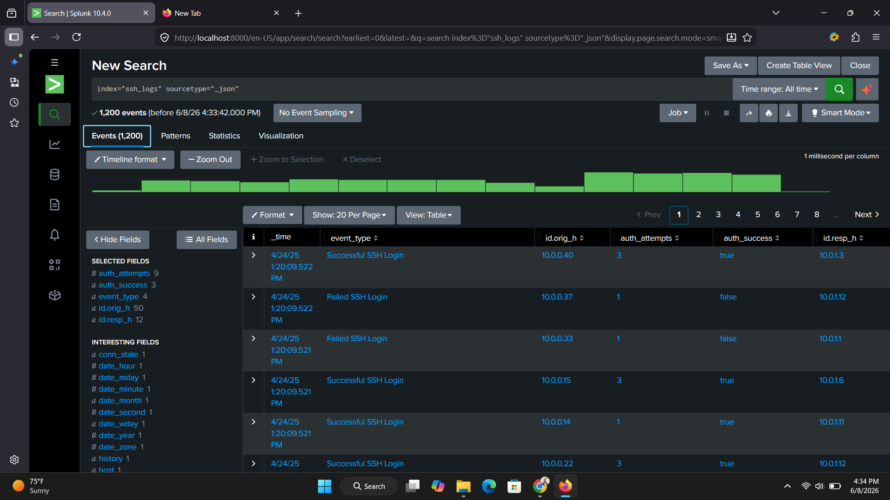

# SSH Brute-Force Detection and Investigation using Splunk

## Overview

This project simulates a SOC analyst workflow for detecting and investigating SSH brute-force attacks. I ingested SSH authentication logs into Splunk Enterprise, built detection queries to surface suspicious login behavior, visualized the results, and produced an incident investigation report — the same workflow used to catch credential-stuffing and brute-force attempts against production Linux servers before they lead to a compromised account.

## Scenario

An organization suspects malicious actors are attempting unauthorized SSH access to Linux servers. As the analyst, I was tasked with:

- Monitoring SSH authentication activity
- Identifying failed login attempts
- Detecting brute-force behavior
- Investigating affected systems
- Producing findings and recommendations

## Environment & Tools

- Splunk Enterprise 10.4
- SPL (Search Processing Language)
- SSH authentication logs (JSON)
- MITRE ATT&CK Framework

## Dataset

SSH authentication events in JSON format.

| Field | Description |
|---|---|
| `id.orig_h` | Source IP |
| `id.resp_h` | Destination IP |
| `auth_attempts` | Authentication attempts |
| `auth_success` | Authentication status |
| `event_type` | Event classification |
| `_time` | Event timestamp |

## Detection Queries

**Top source IPs by failed login volume:**
```spl
index="ssh_logs" sourcetype="_json" auth_success="false"
| stats count by id.orig_h
| rename id.orig_h as source_ip
| sort - count
```

**Top destination IPs (targeted hosts):**
```spl
index="ssh_logs" sourcetype="_json"
| stats count by id.resp_h
| rename id.resp_h as destination_ip
| sort - count
```

**Brute-force detection (source IPs exceeding a failure threshold):**
```spl
index="ssh_logs" auth_success="false"
| stats count by id.orig_h
| where count > 10
```

> The `count > 10` threshold was chosen to flag repeated failure bursts consistent with automated brute-forcing while filtering out normal user mistypes (typically 1-3 failed attempts). In a production environment I'd tune this against a rolling time window (e.g. 10+ failures in 5 minutes) rather than an all-time count, to catch fast automated attacks without waiting on total volume.

## Findings


*Top source IPs by failed SSH login count, isolating the brute-force candidates.*


*Dashboard view of hosts crossing the failure threshold, used to drive the investigation.*

*(Replace the two lines above with your actual screenshot filenames from the `Screenshots/` folder.)*

- Identified a small set of source IPs responsible for the majority of failed authentication attempts — consistent with automated brute-forcing rather than legitimate user error.
- Confirmed no successful authentications originated from the flagged source IPs, indicating the attack was contained at the authentication layer.

## MITRE ATT&CK Mapping

| Technique | ID |
|---|---|
| Brute Force | T1110 |
| Valid Accounts | T1078 |
| External Remote Services | T1133 |

## Impact

Detecting these patterns early — rather than after a successful login — reduces mean-time-to-detect for credential-based attacks and gives the SOC time to block the source IP or enforce account lockout before an attacker succeeds.

## Next Steps

- Convert the detection query into a scheduled Splunk alert with automated IP blocklist integration.
- Add a rolling time-window threshold instead of an all-time count.
- Correlate flagged source IPs against threat intelligence feeds to prioritize response.

---
*Part of my hands-on SOC analyst project portfolio — see my [profile README](https://github.com/jamese345) for more.*
